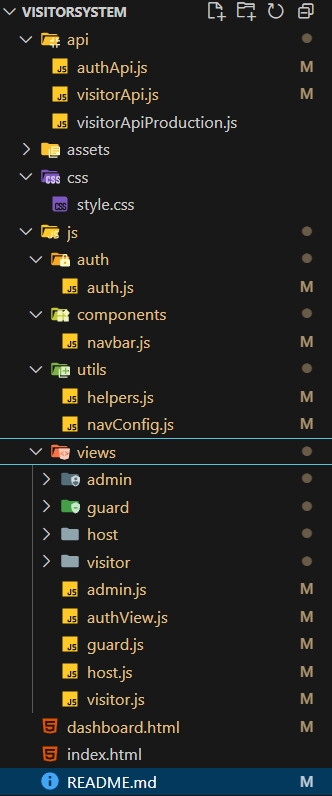

# EZCheck: Modern Visitor Management Solution

The **EZCheck** is a comprehensive web-based application designed to streamline and automate the process of managing visitors within a company or organization. It provides a secure, efficient, and modern solution for visitor registration, tracking, and communication, significantly enhancing facility security and improving the overall visitor experience.

---

## ✨ Features

This system offers a robust set of features categorized by their primary function:

### User & Access Management

- **User Authentication:** Secure login mechanisms for various user roles (Admin, Guard, Host, Visitor).
- **User Registration:** Allows new users to sign up, and enables administrators to register new users for different roles.
- **User Session Management:** Maintains secure user sessions across the application, ensuring data privacy and access control.
- **Role-Based Access Control (RBAC):** Implements a robust authorization system ensuring users can only access features and data relevant to their assigned roles (Admin, Guard, Host, Visitor).

### Visitor Workflow & Tracking

- **Visitor Registration:** Flexible options for visitors to self-register, or for hosts, guards, and admins to register visitors on their behalf.
- **Visitor Check-in:** An efficient process for recording visitor arrival times and initial entry details.
- **Visitor Check-out:** Records visitor departure times, automatically marking the completion of a visit.
- **QR Code Generation:** Generates unique, scannable QR codes for approved visits, facilitating quick and touchless check-in/out.
- **Email Notifications:** Sends automated email alerts for visit requests, approvals, check-ins, and other important events to relevant parties.

### Data Management & Insights

- **Visitor Search:** Provides quick and intuitive search functionality to locate visitor records by name, ID number, or other criteria.
- **Visitor History:** Offers a detailed, searchable log of all past visits for individual visitors, providing valuable insights.
- **Admin Dashboard:** A centralized, powerful interface for administrators to oversee and manage all aspects of the system (visitors, users, visit requests, and system configurations).
- **Host & Guard Interfaces:** Dedicated dashboards and views tailored to the specific operational functions of hosts (managing their visitors) and guards (managing facility access).

### Core System Utilities

- **Robust Error Handling:** Implements comprehensive error handling to provide clear feedback to users and ensure application stability.
- **Responsive Design:** Built with a mobile-first approach, ensuring the application is accessible and user-friendly across various devices (desktops, tablets, mobiles).

---

## 💻 Technologies Used

The VisitorSystem is built using a modern full-stack JavaScript architecture:

- **Frontend:**
  - **HTML5:** For structuring web content.
  - **CSS3:** For styling and visual presentation.
  - **JavaScript (ES6+):** For interactive client-side logic.
  - **Bootstrap 5:** A powerful CSS framework for responsive and consistent UI components.
- **Backend:**
  - **Node.js: (JavaScript)** A JavaScript runtime for server-side execution.
- **Database:**
  - **Local Storeage:** A development storage option.
- **QR Code Generation:**
  - **`qrcode` library:** For generating scannable QR codes.

---

## 🚀 How to Run the Application

Follow these steps to get the VisitorSystem up and running on your local machine.

### Prerequisites

### Setup Steps

1.  **Clone the Repository:**

    ```bash
    git clone [https://github.com/your-username/VisitorSystem.git](https://github.com/ojasvatstyagi/VisitorSystem.git) # Replace with your actual repository URL
    cd VisitorSystem
    ```

## 📁 Project Structure

## 

## 📈 Future Enhancements

As this is a pre-version 1 release, there are many exciting possibilities for future development:

- Advanced reporting and analytics dashboards for administrators.
- Pre-registration and invitation features for hosts to manage upcoming visitors.
- Integration with external systems (e.g., Slack for notifications, calendar integration).
- Advanced security features like email verifiacation
- Dedicated mobile applications for guards and hosts.
- Customizable branding and themes.

---

## 📄 License

This project is licensed under the MIT License. See the [LICENSE](LICENSE) file for details.
